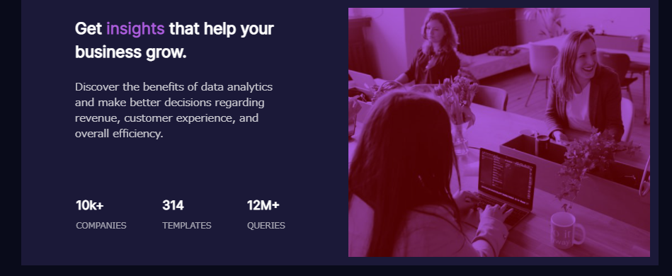

# Frontend Mentor - Stats preview card component solution

This is a solution to the [Stats preview card component challenge on Frontend Mentor](https://www.frontendmentor.io/challenges/stats-preview-card-component-8JqbgoU62). Frontend Mentor challenges help you improve your coding skills by building realistic projects.

## Overview

### The challenge

Users should be able to:

- View the optimal layout depending on their device's screen size

### Screenshot

| Desktop | Mobile |
| :-----: | :----: |
|  |  |

### Links

- https://stats-preview-card-component-bay.vercel.app/

## My process

### Developing

#### Running dev server

```
npm run dev
```

#### Running lint

```
npm run lint
```

### Built with

- Vue3 + Vite
  - with ESLint
  - without TypeScript
  - without JavaScript Test
- Material Design Framework
  - [vuetifyjs/vuetify](https://github.com/vuetifyjs/vuetify)

### What I learned(in Japanese)

- そもそも js プロジェクトの新規作成方法を知らない
  - 前提知識というよりかは漠然としたイメージは次の通り
    1. webpack で依存関係等を解決してバンドルしてくれる
    2. babel , polyfill 等でマルチブラウザ対応の js が生成される
    3. vue cli や npm init より [vitejs/vite](https://github.com/vitejs/vite) でプロジェクトの新規作成を学ぶほうが楽そう

### Continued development

- TypeScript
- ES2015 or later
- E2E Test
  - Playwright
  - Puppeteer

### Useful resources

- Vue3 + Vite
  - https://vitejs.dev/guide/#overview
  - https://devtools.vuejs.org/
- ESLint
  - https://eslint.vuejs.org/user-guide/#installation
- Material Design Framework
  - https://cli.vuejs.org/#getting-started
  - https://next.vuetifyjs.com/en/getting-started/installation/#vite
  - https://next.vuetifyjs.com/ja/features/display-and-platform/
  - https://material.io/design/color/dark-theme.html#ui-application
  - https://github.com/vuetifyjs/vuetify/blob/v3.0.0-alpha.9/packages/vuetify/src/styles/settings/_dark.scss
  - https://next.vuetifyjs.com/ja/features/theme/#setup
  - https://v3.ja.vuejs.org/guide/class-and-style.html#class-and-style-bindings
- CSS
  - https://developers.google.com/fonts/docs/getting_started
  - https://developer.mozilla.org/ja/docs/Web/CSS/background-image
    - url で画像を直接指定したが、画像の幅高さの調整ができなくて諦めた
  - https://developer.mozilla.org/ja/docs/Web/CSS/filter
    - そもそもモノクロの画像なのでトーンが調整できなかったので諦めた
- Git commit
  - [Configuring Git to handle line endings](https://docs.github.com/en/get-started/getting-started-with-git/configuring-git-to-handle-line-endings)
  - [parmentf/GitCommitEmoji.md](https://gist.github.com/parmentf/035de27d6ed1dce0b36a)
- Serverless platform
  - https://vercel.com/docs

## Author

- [@maeda-m](https://github.com/maeda-m)
