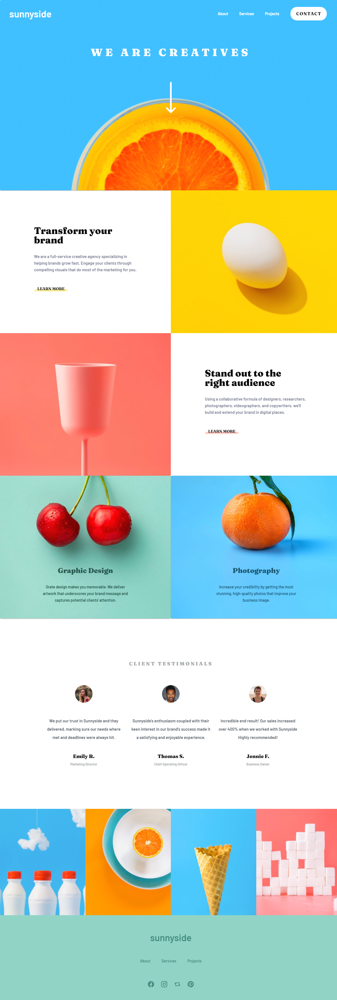
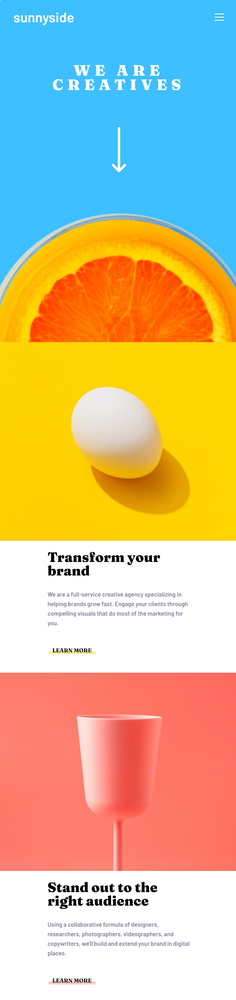

# Frontend Mentor - Sunnyside agency landing page solution

This is a solution to the [Sunnyside agency landing page challenge on Frontend Mentor](https://www.frontendmentor.io/challenges/sunnyside-agency-landing-page-7yVs3B6ef). Frontend Mentor challenges help you improve your coding skills by building realistic projects.

## Overview

### The challenge

Users should be able to:

- View the optimal layout for the site depending on their device's screen size
- See hover states for all interactive elements on the page

### Screenshot

| Desktop | Mobile |
| :-----: | :----: |
|  |  |

### Links

- TODO

## My process

### Developing

#### Running dev server

```
npm run dev
```

#### Running lint

```
npm run lint
```

### Built with

- Vue3 + Vite
  - with ESLint
  - without TypeScript
  - without JavaScript Test
- Material Design Framework
  - [vuetifyjs/vuetify](https://github.com/vuetifyjs/vuetify)

### What I learned(in Japanese)

- TODO

### Continued development

- TODO

### Useful resources

- TODO

## Author

- [@maeda-m](https://github.com/maeda-m)
