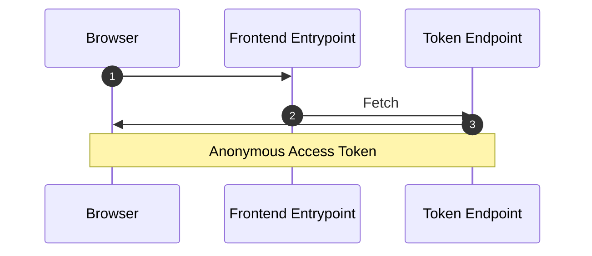
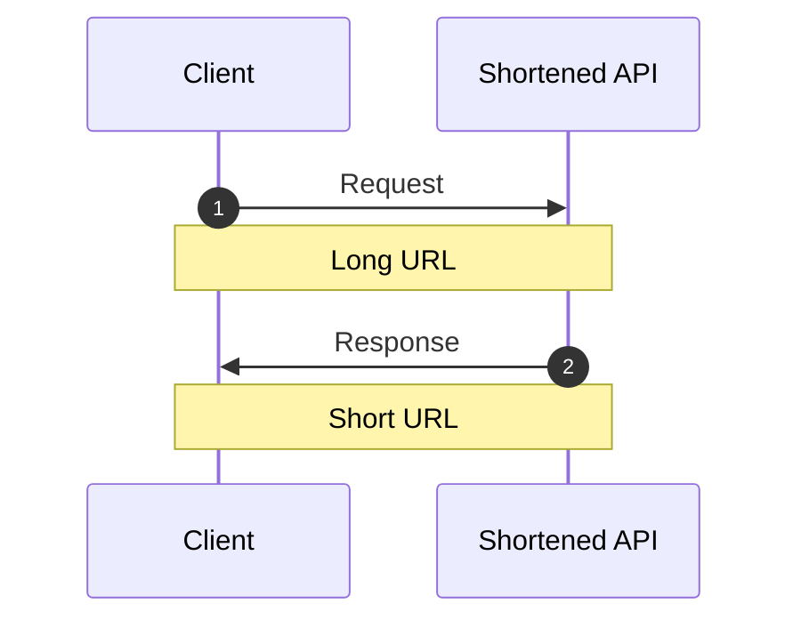
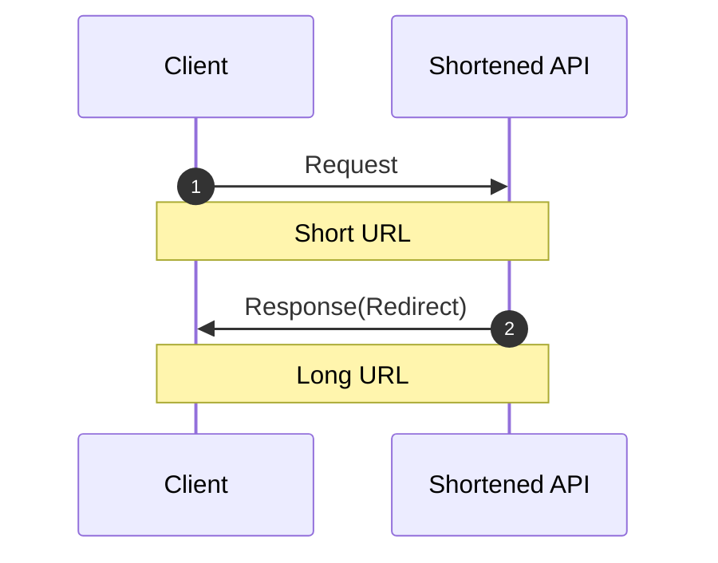

# Frontend Mentor - Shortly URL shortening API Challenge solution

## プロダクトに対する要求

### 機能的な要求

- デバイスの画面サイズに合わせて、サイトの最適なレイアウトを表示する
- 任意の有効なURLを短縮できる
- ブラウザを更新しても、短縮されたリンクの一覧が表示される
- 短縮されたリンクをワンクリックでクリップボードにコピーできる
- フォームの送信時に以下のような状態であればエラーメッセージが表示される
  - 入力フィールドが空の場合

### 非機能的な要求

* 無料で稼働できること

---

## アーキテクチャ全体図

### 匿名利用者

### 短縮URLの発行

### 短縮URLの応答

## 選定した経緯

### 選定した基準や根拠

### 選定しなかった手段

### 外部依存している詳細

### その他観点

#### セキュリティ

#### テストのしやすさ

#### リリースのしやすさ

#### デプロイのしやすさ

#### 運用・保守のしやすさ

---

## 参照リンク
