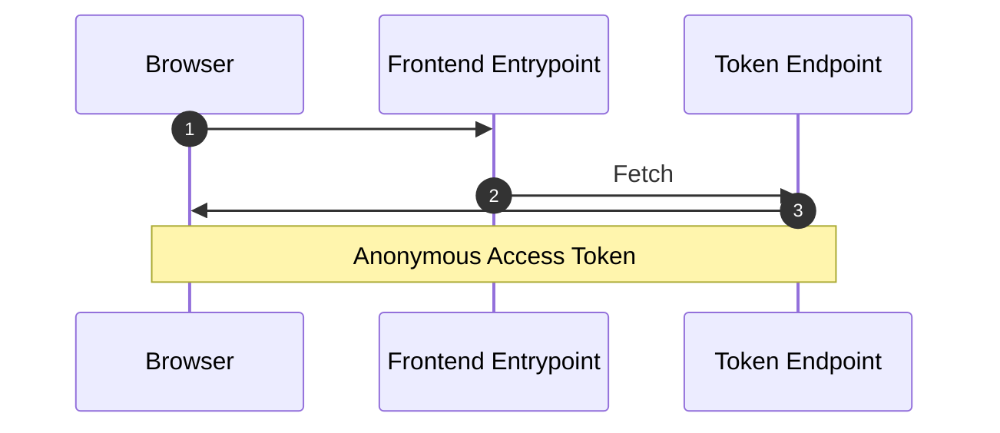
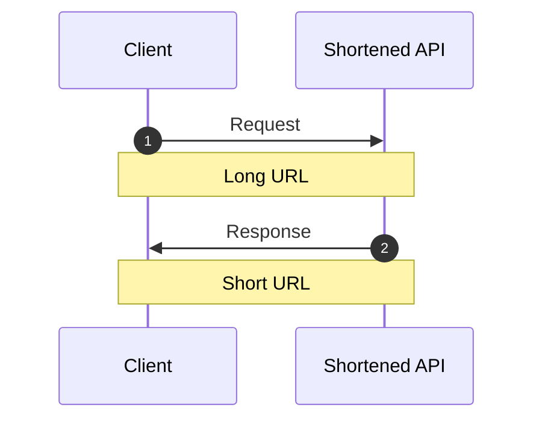
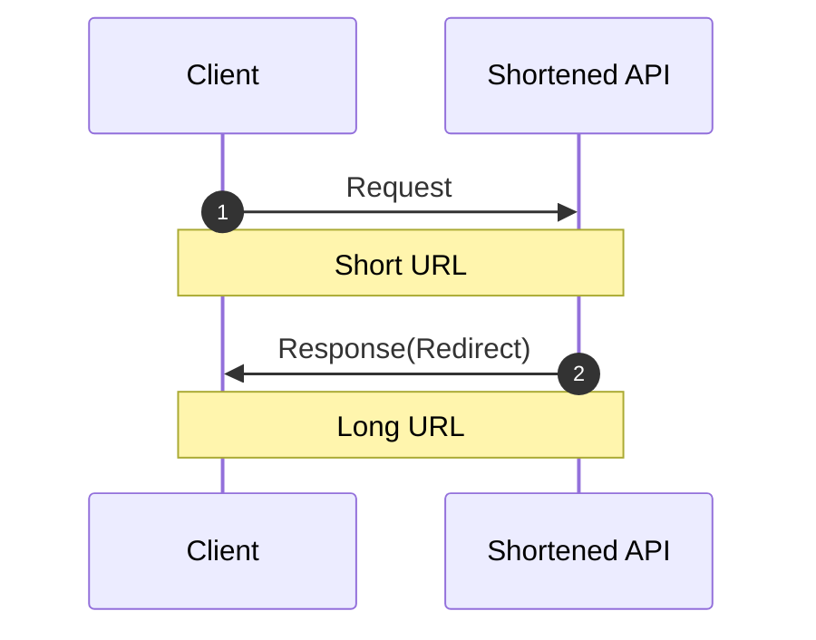

# Frontend Mentor - Shortly URL shortening API Challenge solution

## プロダクトに対する要求

### 機能的な要求

1. デバイスの画面サイズに合わせて、サイトの最適なレイアウトを表示する

2. 任意の有効なURLを短縮できる

3. ブラウザを更新しても、短縮されたリンクの一覧が表示される

4. 短縮されたリンクをワンクリックでクリップボードにコピーできる

5. フォームの送信時に以下のような状態であればエラーメッセージが表示される
   * 入力フィールドが空の場合

### 非機能的な要求

1. 無料で稼働できること
   * 一時的に動作を確認できればいい（常時ではない）

---

## アーキテクチャ全体図

### 匿名利用者

### 短縮URLの発行

### 短縮URLの応答

## 選定した経緯

### 選定した基準や根拠

* 機能的な要求 2
  * 詳細をできるだけ Gem に任せて境界を明確にしたい
    * Gem「[jpmcgrath/shortener](https://github.com/jpmcgrath/shortener)」で責務を果たせそう
* 機能的な要求 3
  * 最低限、ブラウザを閉じるまで匿名の利用者を識別したい
    * ライフサイクルは1日程度のトークン発行APIで実現できそう
      * 改ざんを検知できる [JWT](https://zenn.dev/ritou/articles/4a5d6597a5f250) を使用する
      * セッションハイジャックなどの対策にはならないが、Backend で定期的に発行したトークンを削除する
* 非機能的な要求 1
  * Heroku で下記の環境を前提とする
    * Backend は Rails API
      * 単純に扱いやすい
    * Frontend は Vue3 + Windi CSS via Vite with Ruby
      * 単純に扱いやすい

### 選定しなかった手段

* 機能的な要求 3
  * 外部サービス提供機能「[匿名認証](https://community.auth0.com/t/anonymous-users/65009)」
    * 外部依存はできるだけ避けたいため
    * せっかくなら自前で検討したいため
* 非機能的な要求 1
  * SPA ではなくて SSR でチャレンジしてもよかった気がする

### 外部依存している詳細

* 特になし

### その他観点

#### セキュリティ

* セッション（Cookie）をできるだけ送信しないようにしているが、送信したほうがいいときもある気がする
  * [SPAセキュリティ入門～PHP Conference Japan 2021](https://www.slideshare.net/ockeghem/phpconf2021spasecurity)

#### テストのしやすさ

* そもそもAPIレベルでテストしていないので、E2Eテスト任せ
  * 本来すべきではない範囲をしているため、 [Flaky なテスト](https://nihonbuson.hatenadiary.jp/entry/2018/03/10/110000) になっているのでは

#### リリースのしやすさ

* モノリスで特に問題ないが Frontend と Backend で独立してリリースできたほうがいい
  * 複数人でやるならば。。。

#### ビルドとデプロイのしやすさ

* Frontend と Backend で独立したらいろいろ考えることが増えそう
  * Vite Ruby のおかげで Frontend のビルドの手間がない

#### 運用・保守のしやすさ

* 運用
  * スケールアップはホビープランなので置いておく
  * スケールアウトをしたことはないが、DBさえ共有すればしやすそう
    * Frontend と Backend が独立したらもっとしやすそうだが、サービス間の通信はネットワークを介することになるので、ある程度遅延が発生しそう
      * [API Gateway](https://techblog.zozo.com/entry/zozo-aggregation-api-bff) などはよくわかっていない
  * 最低限のリソース監視や監視すべきメトリクスの洗い出しは考えたほうがいい
    * アクセス数やリンク発行・転送数とか
* 保守
  * 是正（発生した問題を訂正することを指す）
    * モジュラモノリスではない（データベースも分解していない）ため影響範囲が限定しにくい傾向になりそう
  * 予防（是正の横展開や運用上発生していない不具合の修正を指す）
    * 是正で挙げた部分に加えてテストピラミッドが逆転しているので安定した軽量なテスト結果が得られない
      * テストを書かないと不利な状況になっている
  * 適応（環境変化に順応するための改良などを指す）
    * Heroku なので OS 以上の話なら外的要因では変化しなさそう
    * Ruby やらのバージョンアップは、機能確認のための E2Eテストがあるにはある
  * 完全化（改良・改善・性能強化）
    * コントローラーは http での世界（文字列）に変換させるだけに専念したいが、ユースケースの切り出しができていないため、改善しにくそう
    + モデルクラスは [アクティブレコード（PoEAAのパターン）](https://bliki-ja.github.io/pofeaa/ActiveRecord/)を採用して、ドメインレイヤーとデータソースレイヤーを 1 つのクラスで実装できるようになっているはずだが、活用できていない
      * バリデーションとコールバックで [サービスレイヤー（ユースケース）](https://bliki-ja.github.io/pofeaa/ServiceLayer/)のロジックをモデルクラスのDSLやインスタンスメソッドで実装しないといけない
      * [従来のコードレベルでの回避・改善](https://speakerdeck.com/yasaichi/what-is-ruby-on-rails-and-how-to-deal-with-it?slide=51) よりも [データベースレベルでイベント系エンティティを見逃していないか](https://speakerdeck.com/yasaichi/directions-for-the-next-generation-of-ruby-on-rails-from-the-viewpoint-of-its-active-record?slide=32) を確認する必要がある

---

## 参照リンク

* [texta.fm](https://texta.pixta.jp/archive/category/texta.fm)
  * [Active Recordから考える次の10年を見据えた技術選定 / Architecture decision for the next 10 years at PIXTA - Speaker Deck](https://speakerdeck.com/yasaichi/architecture-decision-for-the-next-10-years-at-pixta)
  * [Active Recordから考える次世代のRuby on Railsの方向性 / Directions for the next generation of Ruby on Rails: From the viewpoint of its Active Record - Speaker Deck](https://speakerdeck.com/yasaichi/directions-for-the-next-generation-of-ruby-on-rails-from-the-viewpoint-of-its-active-record)
* [Rails 開発で意識していること 2 · ryym.log](https://ryym.tokyo/posts/my-rails-practice2/)
* [Y.A.M の 雑記帳: ドメイン駆動設計について DroidKaigi 2017 で登壇しました。](http://y-anz-m.blogspot.com/2017/03/droidkaigi-2017_9.html)
* [JAXA共通技術文書 - 技術要求・ガイドライン文書 - JERG-0-049 ソフトウェア開発標準](https://sma.jaxa.jp/TechDoc/)
* [アーキテクチャーパターンとは何か | Think IT（シンクイット）](https://thinkit.co.jp/article/940/1)
