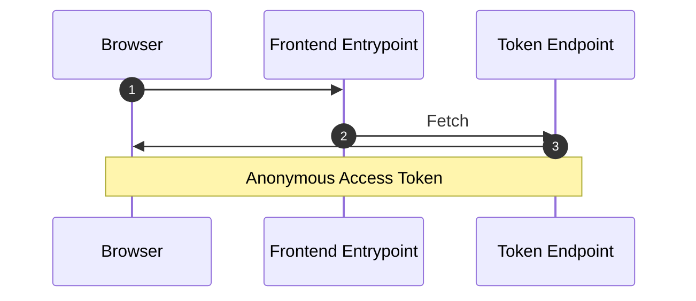
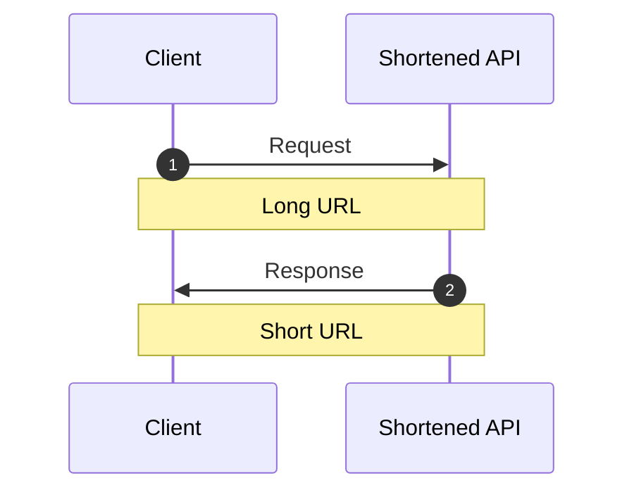
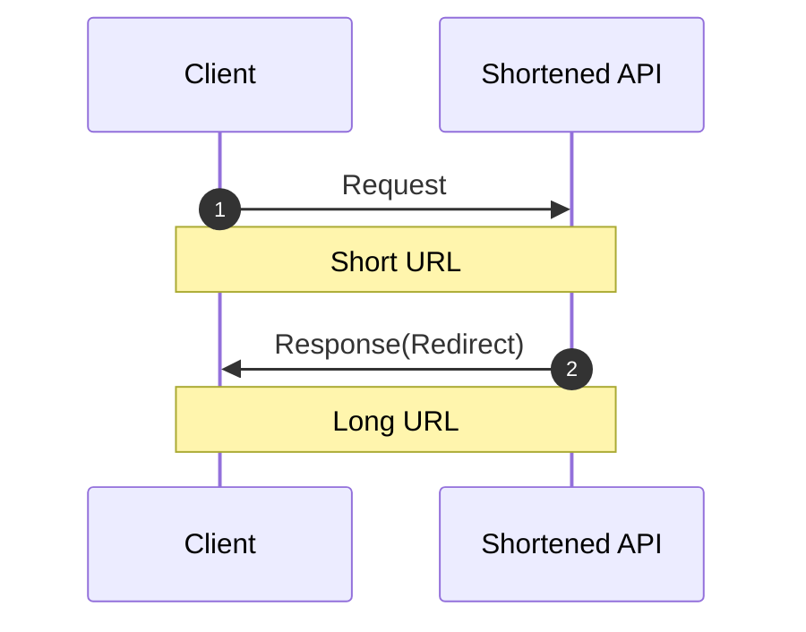

# Frontend Mentor - Shortly URL shortening API Challenge solution

## プロダクトに対する要求

### 機能的な要求

1. デバイスの画面サイズに合わせて、サイトの最適なレイアウトを表示する

2. 任意の有効なURLを短縮できる

3. ブラウザを更新しても、短縮されたリンクの一覧が表示される

4. 短縮されたリンクをワンクリックでクリップボードにコピーできる

5. フォームの送信時に以下のような状態であればエラーメッセージが表示される
   * 入力フィールドが空の場合

### 非機能的な要求

1. 無料で稼働できること
   * 一時的に動作を確認できればいい（常時ではない）

---

## アーキテクチャ全体図

### 匿名利用者

### 短縮URLの発行

### 短縮URLの応答

## 選定した経緯

### 選定した基準や根拠

* 機能的な要求 2
  * 詳細をできるだけ Gem に任せて境界を明確にしたい
    * Gem「[jpmcgrath/shortener](https://github.com/jpmcgrath/shortener)」で責務を果たせそう
* 機能的な要求 3
  * 最低限、ブラウザを閉じるまで匿名の利用者を識別したい
    * ライフサイクルは1日程度のトークン発行APIで実現できそう
      * 改ざんを検知できる [JWT](https://zenn.dev/ritou/articles/4a5d6597a5f250) を使用する
      * セッションハイジャックなどの根本的な対策にはならないが、sessionStorage を使用する
* 非機能的な要求 1
  * Heroku で下記の環境を前提とする
    * Backend を Rails API
      * 単純に扱いやすい
    * Frontend を Vue3 + Windi CSS via Vite with Ruby
      * 単純に扱いやすい

### 選定しなかった手段

* 機能的な要求 3
  * 外部サービス提供機能「[匿名認証](https://community.auth0.com/t/anonymous-users/65009)」
    * 外部依存はできるだけ避けたいため
    * せっかくなら自前で検討したいため
* 非機能的な要求 1
  * SPA ではなくて SSR でチャレンジしてもよかった気がする

### 外部依存している詳細

* 特になし

### その他観点

#### セキュリティ

* セッション（Cookie）をできるだけ送信しないようにしているが、送信したほうがいいときもある気がする

#### テストのしやすさ

* そもそもAPIレベルでテストしていないので、E2E任せ
  * 本来すべきではない範囲をしているため、 [Flaky なテスト](https://nihonbuson.hatenadiary.jp/entry/2018/03/10/110000) になっているのでは

#### リリースのしやすさ

* モノリスで特に問題ないが Frontend と Backend で独立してリリースできたほうがいい

#### ビルドとデプロイのしやすさ

* Frontend と Backend で独立したらいろいろ考えることが増えそう
  * Vite Ruby のおかげで Frontend のビルドの手間がない

#### 運用・保守のしやすさ

* 運用
  * スケールアップはホビープランなので置いておく
  * スケールアウトをしたことはないが、しやすそう
  * 最低限のリソース監視や監視すべきメトリクスの洗い出しは考えたほうがいい
    * アクセス数やリンク発行・転送数とか
* 保守
  * 是正（発生した問題を訂正することを指す）
    * TODO
  * 予防（是正の横展開や運用上発生していない不具合の修正を指す）
    * TODO
  * 適応（環境変化に順応するための改良あんどを指す）
    * Heroku なので OS 以上の話なら外的要因では変化しなさそう
    * Ruby やらのバージョンアップは、機能確認のための E2E があるため、割りとしやすそう
  * 完全化（改良・改善・性能強化）
    * TODO

---

## 参照リンク
