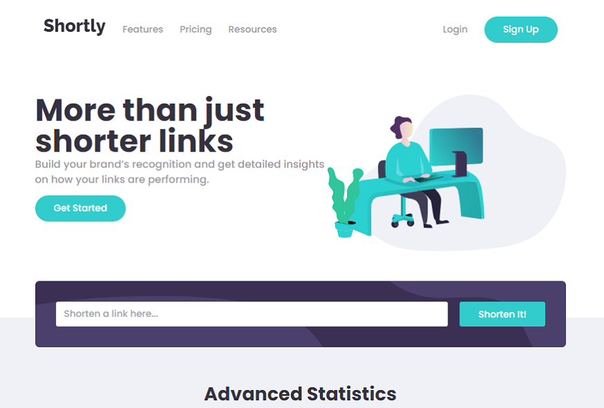
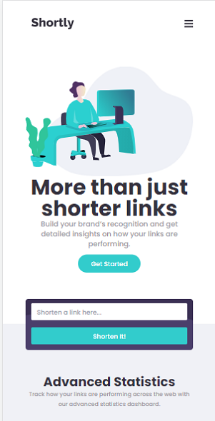

# Frontend Mentor - Shortly URL shortening API Challenge solution

This is a solution to the [Shortly URL shortening API Challenge challenge on Frontend Mentor](https://www.frontendmentor.io/challenges/url-shortening-api-landing-page-2ce3ob-G). Frontend Mentor challenges help you improve your coding skills by building realistic projects.

## Overview

### The challenge

Users should be able to:

- View the optimal layout for the site depending on their device's screen size
- Shorten any valid URL
- See a list of their shortened links, even after refreshing the browser
- Copy the shortened link to their clipboard in a single click
- Receive an error message when the `form` is submitted if:
  - The `input` field is empty

### Screenshot

| Desktop | Mobile |
| :-----: | :----: |
|  |  |

### Links

- TODO

## My process

### Developing

1. Docker run
```
docker-compose up -d
```
2. Running dev server
```
docker-compose exec rails bash
bin/vite dev
```

### Built with

- Backend
  - Rails for API-only
- Frontend
  - Vite Ruby + Vue3
    - without vite-svg-loader
  - Windi CSS
  - Font Awesome
    - `Font Awesome Free 5.15.4 by @fontawesome - https://fontawesome.com License - https://fontawesome.com/license/free (Icons: CC BY 4.0, Fonts: SIL OFL 1.1, Code: MIT License)`
- E2E Test with Playwright
  - https://github.com/YusukeIwaki/capybara-playwright-driver

### What I learned(in Japanese)

- ~~Vite Ruby のホットリロードがうまくいかない（ [ポーリング設定を追加することで解決した](https://github.com/vitejs/vite/issues/1153) ）~~
  - タイムゾーンを合わせたりしたが、template 内の text 変更は即時反映はされない
  - WebSocket の通信は接続までできている（ `[vite] connected.` ）

### Continued development

- ES Modules
  - https://github.com/rails/importmap-rails/
- Visual Regression Test with Storybook
  - https://storybook.js.org/blog/storybook-for-vite/

### Useful resources

- https://guides.rubyonrails.org/api_app.html
- https://vite-ruby.netlify.app/
- https://windicss.org/integrations/vite.html
  - https://tailwindcss.com/docs
- https://github.com/ElMassimo/pingcrm-vite
- https://github.com/FortAwesome/vue-fontawesome/issues/230
- https://coliss.com/articles/build-websites/operation/css/flexbox-cheat-sheets.html
- https://developer.mozilla.org/ja/docs/Web/API/Fetch_API/Using_Fetch
- https://developer.mozilla.org/ja/docs/Mozilla/Add-ons/WebExtensions/Interact_with_the_clipboard
- https://developer.mozilla.org/ja/docs/Web/API/Window/sessionStorage
- https://docs.github.com/ja/developers/apps/building-oauth-apps/authorizing-oauth-apps
- https://zenn.dev/yusukeiwaki/articles/db1cd8d7aa87ed
- https://playwright-ruby-client.vercel.app/docs/article/guides/playwright_on_alpine_linux

## Author

- [@maeda-m](https://github.com/maeda-m)
